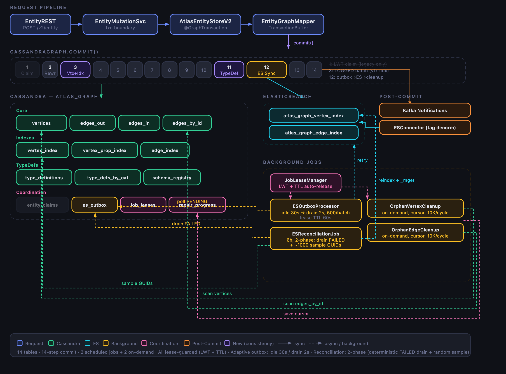

# Zero Graph — Remove JanusGraph from Atlas Metastore

**PRD link (if available):** N/A — infrastructure initiative, not product-driven

**Linear:** [Zero Graph project](https://linear.app/atlan-epd/project/zero-graph-15334b5010bb) (5 open bugs, 8 engineering tasks)

---

# ARB Timeline

- Presented on: March 2026
- Next followup on: TBD (after Ring 1 burn-in)

---

# Problem First

Atlas Metastore uses JanusGraph as a middleware layer between business logic and Cassandra/Elasticsearch. Atlas does not use JanusGraph as a graph database — it uses Cassandra for storage and ES for search. JanusGraph is pure serialization and translation overhead.

| Problem | Impact Today |
|---------|-------------|
| **Binary-encoded data** | Properties stored in JanusGraph's proprietary binary format. `cqlsh SELECT` is useless. Every production investigation requires a JG deserializer — nobody can debug without special tooling |
| **20s+ startup tax** | JG init (RepairIndex, SchemaCache, GremlinEngine, IDManager) runs on every pod restart. Dominates cold-start time across 676 tenants |
| **No distributed concurrency control** | JanusGraph's "ACID" is per-JVM locking — not distributed. Two pods writing the same entity create duplicate vertices. We've seen this in production |
| **ES sync is fire-and-forget** | JanusGraph syncs to ES during commit with 3 retries. If all fail, the entity is lost from search forever until manual reindex |
| **TinkerPop/Gremlin coupling** | Leaks into 40+ files. Changes require understanding Gremlin traversal semantics. Hard to evolve |
| **Data corruption risk** | JanusGraph's proprietary binary format means corrupt files = unrecoverable data. Backup restores are fragile (can't validate binary integrity). Multiple tenants have experienced full data loss |
| **Dependency maintenance** | JanusGraph version upgrades, CVE cycles, TinkerPop compatibility — one more critical dependency to maintain |

## Field Signals

These are not customer-facing signals but recurring operational pain:

| Signal | Detail |
|--------|--------|
| **Recurring `JanusGraphException` tickets** | Multiple support escalations where JG internal lock contention or serialization failures produce opaque stack traces. No actionable root cause without JG internals knowledge |
| **Entity 404 after successful creation** | Weekly occurrence. Entity exists in Cassandra but missing from ES index due to silent ES sync failure. Customer sees "asset not found" in search |
| **Duplicate entities** | Occasional. Two pods create the same entity concurrently — JG's per-JVM lock doesn't prevent it. Manual cleanup required |
| **Slow restarts during incidents** | Every P1/P2 — pods take 45s+ to restart due to JG init. Extends incident duration |
| **Data corruption and total data loss** | JanusGraph stores data in a proprietary binary format across internal files. When a file becomes corrupt — has happened multiple times across tenants — the data is unrecoverable without a full backup restore. Backup restores themselves are fragile because JG's binary format makes it hard to validate integrity. Some tenants have lost data permanently from this |
| **Monthly manual reindex** | After ES outages, JG has no recovery. Full reindex is the only fix |

---

# Architecture / Flow Diagrams


## One codebase, two backends, one config flag

Zero Graph implements the same `graphdb/api/` interface (`AtlasGraph`, `AtlasVertex`, `AtlasEdge`) that JanusGraph uses. A single config flag selects the backend at startup:

```
atlas.graphdb.backend = janus | cassandra
              |
    +---------+---------+
    v                   v
graphdb/janus/       graphdb/cassandra/
(TinkerPop/Gremlin)  (Direct CQL + ES REST)
(Binary storage)     (JSON storage)
    |                   |
    v                   v
Cassandra            Cassandra
(JG binary format)   (plain JSON)
```

- **Default remains `janus`** — every existing deployment is unaffected
- **`graphdb/janus/` has 0 lines changed** — JanusGraph backend stays fully functional
- **1 fork point** in runtime code (`EntityLineageService` delegates to `CassandraLineageService`)
- **6 files modified** in existing code. ~11,000 lines added in isolated new modules

**Architectural constraint — `graphdb/api` interface:** The Cassandra schema is graph-shaped (adjacency lists, property maps, vertex/edge duality) because we kept the existing interface. This is a deliberate tax — if we broke the interface we could model entities as flat wide rows, significantly simpler and faster. But maintaining the interface contract lets us run both backends in one codebase with a config flip, which is the correct tradeoff for a safe rollout across 550+ tenants.

### Commit flow (14 steps)



| Step | What | Type |
|------|------|------|
| 1 | **Claim resolution** — LWT `INSERT IF NOT EXISTS` per new entity for dedup | Cassandra LWT |
| 2 | Rewrite edge endpoints to match claimed vertex IDs | In-memory |
| 3 | **Atomic batch: new vertices + all indexes** (GUID, QN+type, category) | Cassandra LOGGED batch |
| 4 | Update dirty (modified) vertices | Cassandra writes |
| 5 | Batch insert new edges (edges_out + edges_in + edges_by_id) | Cassandra batch |
| 6 | Update dirty edges | Cassandra writes |
| 7 | Batch insert edge index entries (_r__guid_idx) | Cassandra batch |
| 8 | Batch delete removed edges + their index entries | Cassandra batch |
| 9 | Cascade delete removed vertices (edges, vertex row, all indexes) | Cassandra batches |
| 10 | Update dirty vertex index entries | Cassandra batch |
| 11 | Sync typedef vertices to cache (type_definitions tables + Caffeine) | Cassandra + cache |
| 12 | **ES sync** — outbox write → _bulk POST (3 retries) → cleanup on success | Cassandra + ES |
| 13 | Mark transaction elements as persisted | In-memory |
| 14 | Clear transaction buffer + vertex cache | In-memory |

Key atomicity points: Step 1 is LWT (distributed dedup). Step 3 is a LOGGED batch (vertex + indexes can't diverge). Step 12 writes outbox before ES call (crash-safe).

### Cassandra schema (14 tables)

| Table | Purpose | Key Pattern |
|-------|---------|------------|
| `vertices` | Entity properties (JSON) | PK: vertex_id |
| `edges_out` / `edges_in` | Adjacency lists (forward/reverse) | PK: vertex_id, CK: edge_label, edge_id |
| `edges_by_id` | Edge lookup by ID | PK: edge_id |
| `vertex_index` | 1:1 unique lookups (GUID, QN+type) | PK: (index_name, index_value) |
| `vertex_property_index` | 1:N lookups (type category) | PK: (index_name, index_value), CK: vertex_id |
| `edge_index` | Relationship GUID -> edge | PK: (index_name, index_value) |
| `type_definitions` / `type_definitions_by_category` | Fast typedef access | PK: type_name / type_category |
| `schema_registry` | Property key metadata | PK: property_name |
| `entity_claims` | LWT dedup (one vertex per entity) | PK: identity_key. LWT: INSERT IF NOT EXISTS |
| `es_outbox` | Durable ES sync queue | PK: (status), CK: vertex_id. TTL 7d |
| `job_leases` | Distributed job mutex | PK: job_name. LWT + TTL auto-release |
| `repair_progress` | Progressive scan cursors | PK: job_name |

Standard Cassandra pattern: one table per query access pattern. Properties stored as JSON — `cqlsh` reads data directly.

## Other Approaches Considered

| Approach                                             | Why Discarded                                                                                                                                                                                                           |
|------------------------------------------------------|-------------------------------------------------------------------------------------------------------------------------------------------------------------------------------------------------------------------------|
| **Upgrade JanusGraph**                               | Doesn't solve the core problem — JG is middleware overhead we don't need. Binary encoding, TinkerPop coupling, and fire-and-forget ES sync remain                                                                       |
| **Lean Graph**                                       | This project is put on  hold. This approach also yields better benchmarking results but keeps the janusgraph dependency. New Deployments have issues sometimes                                                          |
| **Incremental TinkerPop removal**                    | Considered removing TinkerPop from business logic file-by-file while keeping JG for storage. Would take months, touch 40+ files with high regression risk, and still leave binary encoding and ES sync problems         |
| **Break the `graphdb/api` interface**                | Would allow a cleaner Cassandra schema (flat wide rows instead of adjacency lists). Discarded because it requires modifying all business logic callers — makes rollback impossible and massively increases blast radius |
| **Rewrite atlas Completely using Non VM language**   | This is a large effort and we don't know if we will miss functional aspects in the rewrite                                                                                                                              |

## Prior Art — Facebook TAO Comparison

The Zero Graph data model follows the same pattern as [Facebook TAO](https://www.usenix.org/system/files/conference/atc13/atc13-bronson.pdf) (USENIX ATC '13): store a graph as objects + association lists on a non-graph database.

| Concept | Facebook TAO | CassandraGraph |
|---------|-------------|----------------|
| Storage layer | MySQL (sharded) | Cassandra (partitioned) |
| Vertices | `id → (type, key-value data)` | `vertex_id → (type_name, properties JSON)` |
| Edges | `(id1, atype) → list of (id2, time, data)` | `(out_vertex_id, edge_label) → list of (edge_id, in_vertex_id, data)` |
| Co-location | Association stored on id1's shard | Edge stored in out_vertex_id's partition |
| Bidirectional | Inverse association type (separate write) | `edges_in` table (separate write) |
| Write amplification | Forward + inverse association | edges_out + edges_in + edges_by_id (3 tables) |
| Consistency | Eventual (cache invalidation ~1s) | Eventual (ES outbox, background retry) |

**Key differences:** TAO has a purpose-built two-tier caching layer (leader + follower) serving billions of reads/sec — the cache is the product, MySQL is just persistence. We don't need this: Cassandra serves reads directly at our scale (hundreds of tenants, not billions of users). TAO also has manual sharding (shard ID embedded in object ID); Cassandra gives us automatic partitioning via consistent hashing. TAO maintains cached `assoc_count` per (object, type) — we don't have pre-computed edge counts.

**Takeaway:** The data model is a proven industry pattern, not a novel experiment. TAO, Uber's entity platform, and LinkedIn's graph service all use the same approach: adjacency lists on a non-graph store, with write amplification for fast directional reads.

---

# Scalability

All numbers from production-like environments. Soak test = 1 hour, 50 concurrent workers.

## Headline benchmarks

| Metric | JanusGraph | Zero Graph | Improvement |
|--------|-----------|------------|-------------|
| **Soak throughput (1hr, 50 workers)** | 24K requests | 312K requests | **13x** |
| **Entity create latency (avg)** | 10,378 ms | 80 ms | **130x faster** |
| **Bulk entity latency (avg)** | 33,240 ms | 2,541 ms | **13x faster** |
| **Entity get by GUID (avg)** | 930 ms | 126 ms | **7x faster** |
| **Lineage throughput (RPS)** | 45.9 | 154.7 | **3.4x** |
| **Startup time** | ~45s | ~22.5s | **2x faster** |
| **Ingestion rate (single pod)** | -- | 1.9M assets/hr | Highest recorded |

## Tail latency under load (P99)

| Endpoint | JanusGraph P99 | Zero Graph P99 | Reduction |
|----------|---------------|----------------|-----------|
| entity_create | 15,585 ms | 403 ms | **97%** |
| bulk_entity | 45,981 ms | 4,387 ms | **90%** |
| entity_get_guid | 2,269 ms | 410 ms | **82%** |
| index_search | 1,604 ms | 358 ms | **78%** |

## Resource usage (soak test)

| Resource | JanusGraph | Zero Graph | Reduction |
|----------|-----------|------------|-----------|
| Heap (avg) | 1,239 MB | 544 MB | **56%** |
| Heap (peak) | 1,839 MB | 872 MB | **53%** |
| CPU (avg) | 135.8% | 86.8% | **36%** |

## Migration speed

| Migrator | Workload | Time | Notes |
|----------|----------|------|-------|
| **Old (JanusGraph-based)** | 30M assets (read only) | ~11 hours | Gremlin traversal, no writes |
| **New (CQL token-range)** | 7.7M assets (full: read + write + ES) | ~50 minutes | Direct CQL, includes all writes |

Largest tenant (~98M assets) can complete full migration in ~10-12 hours — achievable over a weekend. Migrator is resumable (crash -> restart -> resumes from checkpoint).

## Known hot spots — partition size analysis

Edges are stored in adjacency-list tables (`edges_out`, `edges_in`) partitioned by vertex ID. All edges leaving a vertex live in one Cassandra partition. Each edge row is ~150-200 bytes (~6 columns: vertex IDs, label, edge ID, properties, state).

| Edges on one vertex | Partition size | Cells (of 2B limit) | Impact |
|---------------------|---------------|---------------------|--------|
| 1,000 | ~200 KB | 6K | No issue |
| 10,000 | ~2 MB | 60K | No issue |
| 100,000 | ~15-20 MB | 600K | Fine for filtered reads. Delete cascade is slow |
| 500,000 | ~75-100 MB | 3M | Approaching recommended limit. Filtered reads still work. Full-partition operations (delete, unfiltered scan) take seconds |
| 1,000,000+ | ~150-200 MB | 6M | Past recommended limit. Compaction pressure. Full-partition reads may timeout |

**Key nuance:** Cassandra's hard limit is 2 billion cells per partition — 500K edges at 6 columns = 3M cells, nowhere near. The practical constraint is **partition read size**: full-partition reads on 100+ MB partitions are slow and GC-heavy. But **label-filtered reads** (`WHERE edge_label = ?`) only scan that label's slice of the partition, so a vertex with 500K total edges but 5 `__Asset.meanings` edges reads 5 rows, not 500K.

**Where it hurts:** operations that touch the full partition — delete cascade (enumerate all edges to clean up counterpart tables), unfiltered edge queries, and compaction on that node.

**Real-world hot spots:**

| Tenant | Problem | Scale |
|--------|---------|-------|
| **DoubleVerify** | Tables with massive column counts | 100K+ edges on single vertices |
| **Discord** | Extremely high edge fan-out | Vertices with enormous adjacency lists |

**Note:** JanusGraph had the same constraint — it also stored adjacency lists in Cassandra partitions. Zero Graph doesn't make this worse, but doesn't solve it either.

**Mitigations (phased):**

| Phase | What | Effect |
|-------|------|--------|
| **Phase 0 (now)** | Label filtering on reads, LIMIT push-down, paginated delete | Reads are fast when label is known. Deletes don't OOM |
| **Phase 1** | Split partition key to `(vertex_id, edge_label)` | Each label gets its own partition. A vertex with 100K column edges + 5 glossary edges → 100K partition + 5-row partition. Non-column operations become instant |
| **Phase 2** | Add `state` to clustering key | `WHERE state = 'ACTIVE'` skips soft-deleted edges at storage layer, not in application code |

---

# Resilience

## ACID tradeoff — the honest version

| Aspect | JanusGraph | Zero Graph |
|--------|-----------|------------|
| **Commit model** | Per-JVM transaction with rollback | 14 sequential Cassandra writes, no cross-step rollback |
| **What "ACID" actually meant** | Lock is JVM-local, not distributed. Two pods writing same entity = duplicate. No protection against partial Cassandra failures during JG commit | Honest about eventual consistency. Explicit mitigation per failure mode |
| **Concurrent writes** | Silent duplicates possible | LWT claims (`INSERT IF NOT EXISTS`) — true distributed dedup |
| **Vertex + index atomicity** | Same JG commit — atomic | Single LOGGED batch (vertex + all indexes in one Cassandra atomic write) |

**Net: JanusGraph's ACID didn't protect against the failures that actually happen (multi-pod conflicts, ES outages, partial writes). Zero Graph trades implicit guarantees for explicit, layered defense.**

## Failure handling mechanisms

| Mechanism | What It Does | Status |
|-----------|-------------|--------|
| **LWT Entity Claims** | Concurrent pod creates same entity -> exactly one wins, loser reuses winner's vertex | Implemented |
| **Atomic Vertex+Index Batch** | Single LOGGED batch writes vertex + all index entries. Eliminates "vertex exists but indexes don't" window | Implemented |
| **Deterministic Retry** | `findByUniqueAttributes(QN+type)` routes retries to UPDATE path. No duplicate entities on retry | Built-in |
| **Pre-Validation** | Move all validation before any Cassandra writes. Business errors -> clean 400, zero side effects | Planned |

## ES sync — outbox-first flow

Every ES write is persisted in `es_outbox` (Cassandra) before attempting ES sync. If anything crashes, the entry survives for background retry.

| Step | What Happens | Timing |
|------|-------------|--------|
| 1. Write to outbox | All entries inserted into `es_outbox` with status=PENDING | During commit, before ES call |
| 2. Sync to ES | ES `_bulk` POST, 3 retries with exponential backoff | During commit |
| 3. Cleanup on success | Delete successful entries from PENDING | During commit |
| 4. Background retry | `ESOutboxProcessor`: adaptive polling (idle 30s / drain 2s, batch 500). ~15K entries/min. Lease-guarded, 1 pod only | Continuous |
| 5. Failed entries | After 10 retries: moved to FAILED partition, preserved for investigation. TTL 7d | On max retry |
| 6. Sample reconciliation | Pick ~1000 random GUIDs from Cassandra every 6h, check ES via `_mget`, reindex missing. Alert if miss rate > 5% | Every 6 hours |

**Key property:** If the process crashes between step 1 and step 2, the outbox entry survives. Background processor picks it up. This is strictly better than JanusGraph's fire-and-forget.

**Consistency window:** Happy path = milliseconds. ES down = background processor within 30s. All mechanisms fail = reconciliation within 6 hours.

## Background repair jobs

| Job | Scans | Repairs | Schedule |
|-----|-------|---------|----------|
| **OrphanVertexCleanup** | `vertices` table | Missing index entries | On-demand, progressive (10K rows/cycle, persistent cursor) |
| **OrphanEdgeCleanup** | `edges_by_id` | Edges pointing to deleted vertices | On-demand, same progressive pattern |
| **ESReconciliationJob** | `vertex_index` (random sample) | Cassandra entities missing from ES | Every 6h |

All jobs lease-guarded via `JobLeaseManager` (Cassandra LWT + TTL). Only one pod runs each job. Crashed pods auto-release lease within TTL.

---

# Observability

**Current state: basic logging. Dashboard is planned work (MS-689).**

What we have today:
- ESOutboxProcessor logs queue depth, drain rate, and failure counts per cycle
- Repair jobs log rows processed, repairs made, and cycle completion
- All background jobs log lease acquire/release events
- Commit path logs per-step timing when debug enabled

What we need before Ring 2 (MS-689):

| Metric | Why It Matters |
|--------|---------------|
| ES outbox PENDING queue depth | Rising queue = ES sync falling behind. Alert threshold: > 1000 entries sustained |
| LWT claim collision rate | High rate = concurrent write contention. Expected: < 1% of creates |
| Commit latency P99 (broken down by step) | Identifies which of the 14 steps is slow |
| ES sync success rate | Percentage of entries that succeed on first attempt vs need retry |
| Background job health | Lease acquisition, rows processed per cycle, repair counts |

---

# Security

No new security surface introduced.

- **No new network endpoints** — Zero Graph uses the same Cassandra and ES connections as JanusGraph
- **No new authentication** — reuses existing Cassandra credentials and ES auth from `atlas-application.properties`
- **No new images or services** — runs within the existing Atlas pod
- **Migrator** — ships inside the existing Docker image at `/opt/apache-atlas/bin/atlas_migrate.sh`. No external access needed
- **Data format change** — properties move from JG binary to JSON in Cassandra. JSON is more readable, which is a debugging benefit but means Cassandra data is human-readable if someone has CQL access (same access level as before, just the encoding changes)

---

# Supportability

This is one of the primary motivations for Zero Graph.

| Aspect | JanusGraph (today) | Zero Graph |
|--------|-------------------|------------|
| **Debugging a missing entity** | Requires JanusGraph deserializer to read binary Cassandra data. Most engineers can't do this | `cqlsh SELECT * FROM vertices WHERE vertex_id = ?` — JSON, readable by anyone |
| **Checking if entity is indexed** | Query JG's opaque index structures | `cqlsh SELECT * FROM vertex_index WHERE index_name = '__guid_idx' AND index_value = ?` |
| **Checking ES sync status** | No visibility. Hope it worked | `cqlsh SELECT * FROM es_outbox WHERE status = 'PENDING'` — see exactly what's queued |
| **Understanding edge relationships** | Binary-encoded edge store | `cqlsh SELECT * FROM edges_out WHERE out_vertex_id = ?` — human-readable edge label, properties |
| **Root cause for duplicate entities** | Opaque. JG internal state | `entity_claims` table shows exactly which pod won the claim and when |
| **Repair after ES outage** | Full manual reindex (hours) | Self-healing: outbox retry + reconciliation. Manual: `reindexVertices(guids)` for targeted fix |

---

# Cost Impact

## Savings

| Resource | JanusGraph | Zero Graph | Impact |
|----------|-----------|------------|--------|
| **Heap per pod** | 1,239 MB avg (soak) | 544 MB avg (soak) | **56% reduction** — enables smaller instance types or higher density |
| **CPU per pod** | 135.8% avg (soak) | 86.8% avg (soak) | **36% reduction** |
| **Startup time** | ~45s | ~22.5s | Faster scaling, faster incident recovery |
| **Dependency maintenance** | JG upgrades, CVE patches, TinkerPop compat | Eliminated | Engineering time saved |

Fleet-wide (676 tenants): heap reduction of ~100-230 MB per pod, translating to ~67-155 GB total. This is compute cost reduction — either smaller instances or more tenants per node.

## Potential increase

**Cassandra disk:** Zero Graph denormalizes across 14 tables (vs JG's single `edgestore`). Every edge writes to 3 tables. JSON is larger than binary encoding. Exact multiplier TBD — need `nodetool tablestats` comparison on staging (action item before Ring 1 expansion).

**Context:** Even with higher storage, Cassandra disk is cheap relative to compute/memory savings. The operational cost reduction (no JG binary debugging, no version upgrades, faster incident response) is the larger factor.

---

# Release Process

## Ring-based rollout with soak periods

Each ring must pass validation criteria before expanding. Fleet-wide timeline depends on ring validation results — not committing to a date until we have data.

| Ring | Scope | Validation Criteria | Soak Period |
|------|-------|--------------------|-------------|
| **Ring 0** | QA environments (e2e-aws-preprod, leangraph-test, idonlygraphqa) | Playwright E2E, SDK tests, connector workflows | Current — running now |
| **Ring 1** | 3-5 empty/tiny canary tenants | All APIs monitored, search parity, lineage parity, no P1/P2 | 2 weeks minimum |
| **Ring 2** | 20-50 small/medium tenants | SDK full suite pass, soak period clean, Heka migrated | TBD based on Ring 1 |
| **Ring 3** | Remaining 450+ tenants (GA) | Batch migration tooling, automated validation | TBD based on Ring 2 |
| **Ring 4** | Decommission JanusGraph | Remove JG code, TinkerPop dependencies | After GA burn-in |

## Environments currently running Zero Graph

| Environment | Since | Assets | Purpose |
|-------------|-------|--------|---------|
| staging.atlan.com | Feb 24 | 7.7M | Production-like validation |
| dubaiairports-new.atlan.com | Earlier | 2.4M | Production copycat |
| e2e-aws-preprod.atlan.com | Feb 26 | -- | Real connector workflows running |
| leangraph-test.atlan.com | Feb 27 | -- | SDK test battery (94-97% pass) |
| idonlygraphqa.atlan.com | Earlier | -- | Dedicated QA |

## Rollback

- **Mechanism:** Config flip (`atlas.graphdb.backend=janus`) + pod restart (~22s)
- **Data impact:** Zero Graph uses a separate ES index (`atlas_graph_vertex_index`). Reverting to JG means data written during ZG period is lost from search (Cassandra data preserved in both keyspaces)
- **Mitigation:** Ring-based rollout with soak periods — validate thoroughly before expanding. Small blast radius per ring
- **JanusGraph data is never modified** — migration is copy-not-move

## Prerequisites before Ring 1 expansion

| Item | Status | Ticket |
|------|--------|--------|
| Migrator populates `edge_index` (relationship GUID lookups) | P0 — must fix | -- |
| Migrator fail-fast on integrity failures | P0 — in progress | -- |
| Heka migrated from direct `janusgraph_vertex_index` dependency | Blocker for Ring 1 | MS-670, MS-671, MS-672 |

## Risks

| Risk | Severity | Mitigation | Status |
|------|----------|-----------|--------|
| **Rollback loses ZG-period search data** | HIGH | Ring-based rollout + soak. Small blast radius per ring | Accepted tradeoff |
| **Migrator edge_index gap** | HIGH | Add `_r__guid_idx` to migrator | P0 fix needed |
| **Heka ES index dependency** | HIGH | 3 tickets to migrate Heka to metastore ES endpoint | Ring 1 blocker |
| **Unknown API contract breakage** | MEDIUM | SDK tests 94-97%. 5 open bugs tracked in Linear | In progress |
| **Super vertex timeouts** | MEDIUM | Phase 0 mitigations (LIMIT, pagination). Phase 1 planned | In progress |
| **No cross-step rollback in commit** | MEDIUM | LWT dedup, atomic vertex+index batch, outbox for ES, repair jobs | Layered defense |
| **LWT write latency** | LOW | ~4x normal write latency, but only on CREATE. 530 LWT/sec at 1.9M assets/hr — within capacity. Benchmarks include this cost | Accepted |

---

# Decision Points

| Question | Options | Our Recommendation |
|----------|---------|-------------------|
| Proceed to Ring 1 (canary)? | Yes / No | **Yes** — after P0 fixes (edge_index, fail-fast migration) and Heka migration |
| Expand to Ring 2 (early adopters)? | Yes / Hold | **Hold** — until Ring 1 burn-in + SDK full suite pass + observability dashboard |
| Decommission JanusGraph? | After GA / Never | **After GA + burn-in** — then remove JG code entirely |

**What we want from ARB:**

1. **Feedback on the consistency model** — is the layered approach (LWT + outbox + reconciliation) sufficient, or do you see gaps?
2. **Approval to proceed to Ring 1** after P0 prerequisites
3. **Input on validation criteria** you'd want before Ring 2 expansion

---

# Appendix

## A. Open Linear Issues

All tracked in [Zero Graph project](https://linear.app/atlan-epd/project/zero-graph-15334b5010bb).

**Bugs (5):** MS-670 (Heka INVALID_CONNECTION), MS-682 (KafkaTest), MS-681 (AtlanTagTest), MS-680 (DataverseAssetTest), MS-679 (GlossaryTest)

**Key engineering:** MS-690 (automated rollout), MS-689 (observability dashboard), MS-683 (transaction strategy), MS-684 (super vertex), MS-692 (indexsearch optimization), MS-672 (ES index audit), MS-671 (Heka migration), MS-675 (MDLH extraction)

## B. Lineage Representation

Atlas lineage alternates: **Dataset → Process → Dataset → Process → ...** Processes are the connectors between datasets. Two edge labels drive all lineage:

- `__Process.inputs` — "this dataset is an input to this process" (out_vertex = dataset, in_vertex = process)
- `__Process.outputs` — "this process outputs this dataset" (out_vertex = process, in_vertex = dataset)

**Example pipeline:** raw_orders → ETL Job → clean_orders → Agg Job → order_summary

```
edges_out table (partition key = out_vertex_id):

out_vertex_id  | edge_label          | in_vertex_id
───────────────┼─────────────────────┼──────────────
raw_orders     | __Process.inputs    | ETL Job         ← "raw_orders feeds ETL Job"
ETL Job        | __Process.outputs   | clean_orders    ← "ETL Job produces clean_orders"
clean_orders   | __Process.inputs    | Agg Job         ← "clean_orders feeds Agg Job"
Agg Job        | __Process.outputs   | order_summary   ← "Agg Job produces order_summary"
```

**Downstream traversal** (from raw_orders): each hop is one CQL partition query.

```
HOP 1: edges_out WHERE out_vertex_id = raw_orders   AND edge_label = '__Process.inputs'  → ETL Job
HOP 2: edges_out WHERE out_vertex_id = ETL Job      AND edge_label = '__Process.outputs' → clean_orders
HOP 3: edges_out WHERE out_vertex_id = clean_orders  AND edge_label = '__Process.inputs'  → Agg Job
HOP 4: edges_out WHERE out_vertex_id = Agg Job       AND edge_label = '__Process.outputs' → order_summary
```

**Upstream traversal** (from order_summary): same logic, uses `edges_in` instead.

```
HOP 1: edges_in WHERE in_vertex_id = order_summary  AND edge_label = '__Process.outputs' → Agg Job
HOP 2: edges_in WHERE in_vertex_id = Agg Job        AND edge_label = '__Process.inputs'  → clean_orders
HOP 3: edges_in WHERE in_vertex_id = clean_orders   AND edge_label = '__Process.outputs' → ETL Job
HOP 4: edges_in WHERE in_vertex_id = ETL Job        AND edge_label = '__Process.inputs'  → raw_orders
```

This is why both `edges_out` and `edges_in` exist — downstream queries by `out_vertex_id`, upstream queries by `in_vertex_id`. Cassandra can only efficiently query by partition key, so one table per direction.

**Algorithms:** Classic lineage uses recursive DFS. List lineage uses queue-based BFS with pagination. Both use visited sets for cycle detection — cycles are fully representable in the data model (no DAG constraint). Every query is a single-partition lookup filtered by edge label. No full-table scans, no ALLOW FILTERING.
